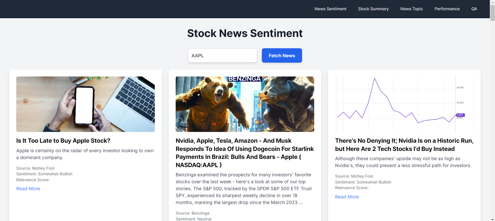
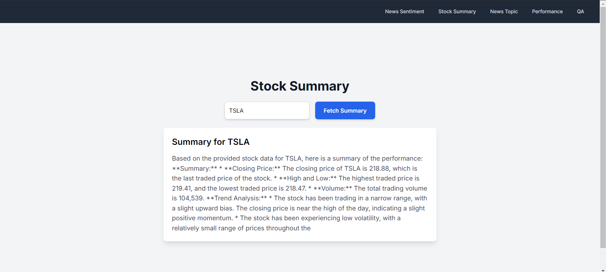
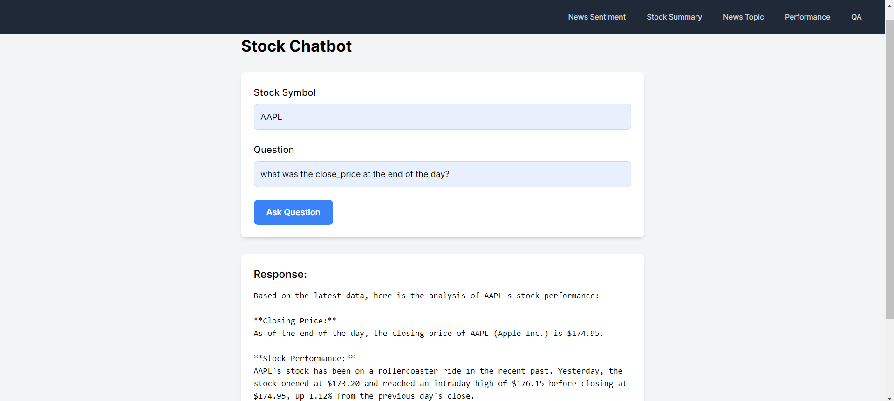
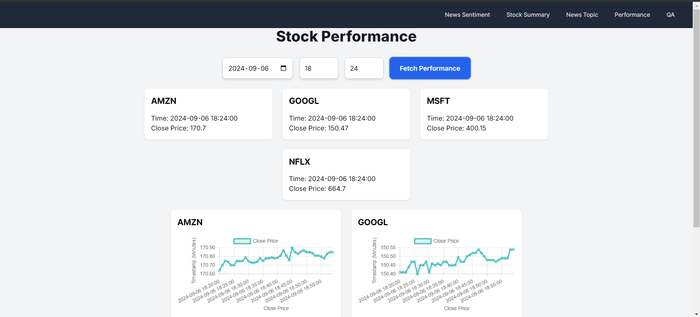
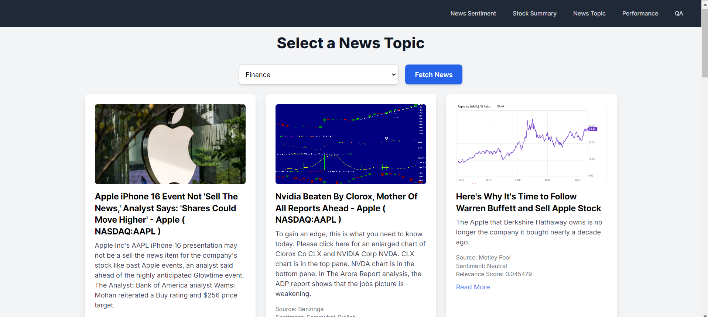

# Stock Market Predictor

Welcome to the **Stock Market Predictor**! This web application helps users analyze stock performance, get insights from news sentiment, and more, using real-time data.

## Live Demo

Check out the live version of the app here: [Live Demo](https://stockmarket-ni8fq5omk-ankurs-projects-05d34165.vercel.app/)

## Features

- 📰 **News Sentiment Analysis**: Get sentiment data based on news articles related to your favorite stocks.
- 📈 **Stock Summary**: View detailed summaries of stock performance, including prices and trends.
- 💬 **Stock QA Chatbot**: Ask questions and get real-time insights on various stock-related queries.
- 📊 **Stock Performance Tracking**: Visualize and track stock performance with charts and graphs.

## Screenshots

Here are some screenshots of the project:

### Homepage

### News Sentiment Page

### Stock Summary Page

### Chatbot

### Stock Performance

### News

